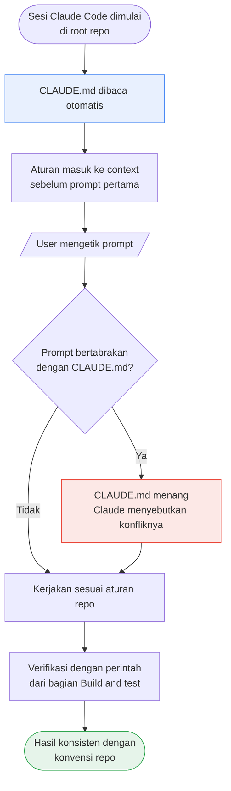
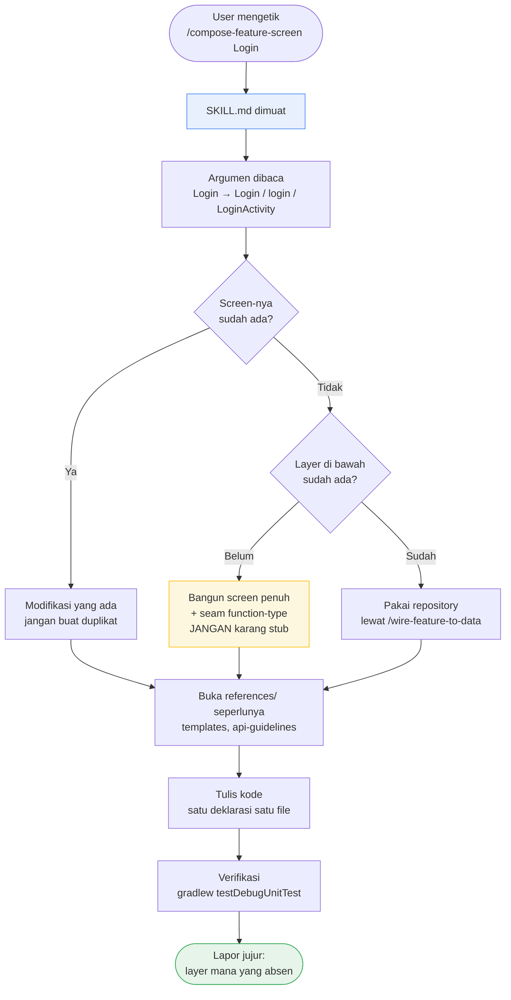
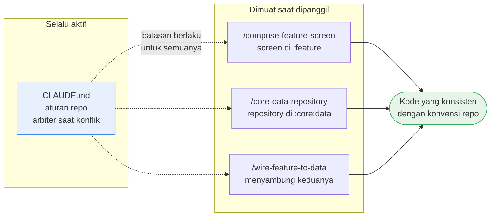

# DemoClaudeAgent

Project Android multi-module yang dipakai sebagai **bahan contoh (sample) penggunaan Claude Code** —
khususnya dua mekanisme yang menentukan seberapa berguna Claude di sebuah repo: `CLAUDE.md` dan
**Agent Skills** (`SKILL.md`).

Kodenya sendiri sengaja dibiarkan minim. Yang menjadi "isi" dari repo ini justru file instruksinya.

## 1. Penjelasan project

Sebuah skeleton aplikasi Android dengan empat module dan arah dependensi satu arah:

```
:app  ──►  :feature  ──►  :core:data  ──►  :core:common
```

| Module | Isi | Status hari ini |
| --- | --- | --- |
| `:app` | manifest, theme, resource, perakitan dependensi | ada, tanpa business logic |
| `:feature` | UI (Compose + ViewBinding) + ViewModel | `src/main` masih kosong |
| `:core:data` | repository, data source, mapper, domain model | hanya `.gitkeep` |
| `:core:common` | utility Kotlin murni, tanpa `android.*` | hanya `.gitkeep` |

Yang membuat repo ini menarik sebagai sample: **test-nya sudah ada, implementasinya belum.**
`feature/src/test/` berisi `PostListViewModelTest`, `QueryFilterTest`, dan `PostListScreenTest` yang
memanggil class yang belum pernah ditulis. Test itulah spesifikasinya — nama class, signature
function, dan perilaku yang diharapkan dibaca dari sana. `AndroidManifest.xml` di `:app` juga sudah
mendaftarkan `com.sample.demo.feature.postlist.PostListActivity` sebagai launcher activity.

Jadi repo ini adalah situasi nyata yang sering dihadapi: ada kontrak, ada aturan arsitektur, tapi
lapisan bawahnya belum jadi. Persis kondisi di mana `CLAUDE.md` dan skill membuktikan gunanya.

Toolchain: Java 11, compileSdk/targetSdk 37, minSdk 24, AGP 9.3.1, configuration cache aktif, semua
dependensi lewat version catalog `gradle/libs.versions.toml`. Tidak ada DI framework, tidak ada
mocking library, tidak ada ktlint/detekt.

```powershell
.\gradlew.bat projects              # daftar module
.\gradlew.bat testDebugUnitTest     # semua unit test
.\gradlew.bat :app:assembleDebug    # build APK debug
```

---

## 2. Dua konsep dasar

### i. Apa itu `CLAUDE.md`?

`CLAUDE.md` adalah **file konteks project yang otomatis dibaca Claude Code setiap sesi dimulai**.
Isinya dimuat ke context window sebelum Anda mengetik prompt pertama — Anda tidak perlu menyuruh
Claude membacanya, dan tidak perlu mengulang-ulang aturan yang sama di setiap prompt.

Analoginya: **onboarding doc untuk anggota tim baru** yang selalu ingat dan tidak pernah bosan
membacanya. Isinya hal yang tidak bisa disimpulkan dari kode saja:

- struktur module dan arah dependensi yang boleh
- versi toolchain yang **tidak boleh** "dimodernkan"
- perintah build & test yang benar
- keputusan arsitektur beserta alasannya (kenapa *tidak* ada `:domain`, kenapa *tidak* pakai Hilt)
- konvensi penamaan, format, testing, dan git

Sifat penting: **selalu aktif, berlaku untuk semua pekerjaan, dan menang saat terjadi konflik.**

> Letak file: `CLAUDE.md` di root repo (di-commit, dibagi ke seluruh tim). Bisa juga per-direktori,
> atau `~/.claude/CLAUDE.md` untuk aturan pribadi lintas project.

### ii. Apa itu `SKILL.md`?

`SKILL.md` adalah **satu Agent Skill: paket instruksi untuk satu jenis pekerjaan tertentu**, yang
hanya dimuat ketika pekerjaan itu benar-benar dikerjakan.

Kalau `CLAUDE.md` adalah onboarding doc, skill adalah **SOP untuk satu tugas** — tebal, detail,
berisi template kode, checklist verifikasi, dan jebakan yang biasa terjadi. Membiarkan semua SOP itu
selalu aktif akan memenuhi context window dengan hal yang tidak relevan; maka ia dimuat *on demand*.

Struktur satu skill:

```
.claude/skills/<nama-skill>/
├── SKILL.md              # frontmatter + instruksi utama (yang dimuat lebih dulu)
└── references/           # file pendukung, dibuka hanya kalau dibutuhkan
    ├── templates.md
    └── ...
```

Frontmatter `SKILL.md` menentukan perilakunya:

```yaml
---
name: compose-feature-screen
description: Build a screen in the :feature module with Jetpack Compose — ...
argument-hint: "[FeatureName] [deskripsi screen bebas]"
disable-model-invocation: true
---
```

- `name` — sekaligus jadi nama slash command: `/compose-feature-screen`
- `description` — satu-satunya bagian yang selalu ada di context; dari sinilah relevansi dinilai
- `argument-hint` — bentuk argumen yang bisa diketik setelah nama skill
- `disable-model-invocation: true` — **Claude tidak boleh memuatnya sendiri**; hanya user yang bisa

Ketiga skill di repo ini memakai `disable-model-invocation: true`. Ini keputusan sengaja: skill-nya
opinionated dan mengubah banyak file, jadi pemanggilannya harus eksplisit. Kalau ada permintaan yang
masuk ke ranah sebuah skill, Claude akan **menyebutkan nama skill itu dan mempersilakan Anda
menjalankannya**, bukan diam-diam memuatnya.

### Perbandingan singkat

| | `CLAUDE.md` | `SKILL.md` |
| --- | --- | --- |
| Kapan dimuat | otomatis, tiap sesi | saat dipanggil (di sini: manual saja) |
| Cakupan | semua pekerjaan di repo | satu jenis pekerjaan |
| Isi | aturan, batasan, konvensi | prosedur, template, checklist |
| Ukuran ideal | ringkas, padat | boleh panjang + file `references/` |
| Saat konflik | **menang** | mengalah ke `CLAUDE.md` |

---

## 3. Isi repo ini

### i. `CLAUDE.md`

Berperan sebagai **arbiter** — dokumen yang memutuskan saat aturan saling bertabrakan. Isinya:

- **Module & dependency rules** — `:feature` dilarang punya Repository/DataSource, `:core:common`
  nol `android.*`, logic antar-screen ke `feature/util/`, bukan module feature kedua
- **Current state of the repo** — menyatakan terang-terangan bahwa test adalah spesifikasi, dan
  test **tidak boleh diedit** agar cocok dengan kode baru
- **Toolchain** — Java 11 (bukan 17), AGP 9.3.1, wrapper saja, version catalog saja
- **Architecture** — MVVM unidirectional; kenapa tidak ada `:domain`; satu `StateFlow<UiState>` per
  screen; event sekali-jalan lewat `Channel`, tidak pernah di dalam `UiState`
- **Keputusan yang diikat di sini** supaya ketiga skill konsisten: varian result adalah
  `Result.Success` / `Result.Failure` (**bukan** `Result.Error`); state milik ViewModel diekspos
  dengan `asStateFlow()`, `stateIn(...)` hanya untuk state turunan dari flow lain; error ke UI jadi
  `errorMessage: String?`, bukan sealed `UiError`
- **Code style, testing, git etiquette, gotchas**

### ii. Skill `compose-feature-screen`

> `/compose-feature-screen [FeatureName] [deskripsi bebas]` — mis. `/compose-feature-screen Login`

Membangun satu screen di `:feature` sebagai **lima bagian terpisah**: `UiState`, event, ViewModel,
stateless screen, dan komponen reusable — mengikuti AndroidX Compose component API guidelines.

Yang dibawanya:

- **Argumen nama screen** yang dinormalisasi jadi tiga bentuk: `Login` → class `Login...`, package
  `login`, activity `LoginActivity`. Menerima `PascalCase`, `kebab-case`, `snake_case`, atau nama
  berspasi dalam tanda kutip. Tanpa argumen pun tetap jalan seperti biasa
- **Satu deklarasi satu file** — `LoginUiState.kt`, `LoginEvent.kt`, `LoginEffect.kt` (kalau ada),
  `LoginUiModel.kt` (kalau ada), masing-masing terpisah
- **Aturan "missing layers"**: kalau `:core:data` belum ada, screen tetap dibangun penuh, dan
  dependensinya ditinggal sebagai parameter function-type yang default-nya `{ emptyList() }`.
  **Dilarang** membuat stub repository, fake data source, atau data contoh
- **Tidak pernah membuat theme** — pakai theme module kalau ada, kalau tidak `MaterialTheme` langsung
- `references/api-guidelines.md`, `references/templates.md`, `references/toolchain.md`

### iii. Skill `core-data-repository`

> `/core-data-repository [DomainName] [deskripsi bebas]` — mis. `/core-data-repository Post`

Membangun repository di `:core:data`: domain model → mapper → data source `internal` → kontrak
repository publik.

Yang dibawanya:

- **Boundary rule** yang jadi alasan module ini ada: `:feature` tidak boleh pernah melihat tipe
  jaringan. Sebelum selesai, setiap deklarasi `public` diperiksa — tidak boleh ada `<X>Dto`,
  `Response`, `Retrofit`, `OkHttp*`, `Call`, `@SerializedName` di signature-nya
- Karena tidak ada module `:core:network`, **`internal` adalah satu-satunya penjaga batas** —
  Gradle tidak akan menangkap kebocorannya
- **Aturan "fabricate nothing"** yang sama, satu lapis di bawah: kalau belum ada HTTP client, jangan
  mengarang DTO/Retrofit interface/list hardcoded
- Test pakai fake tulis tangan — tidak ada mocking library dan tidak boleh ditambahkan
- `references/templates.md`, `references/testing.md`

### iv. Skill `wire-feature-to-data`

> `/wire-feature-to-data`

Dua skill di atas sengaja berhenti di seam masing-masing. **Skill inilah yang menyambungnya**,
setelah kedua sisi benar-benar ada.

Yang dibawanya:

- mengganti parameter function-type di ViewModel dengan repository sungguhan
- menulis mapper domain → UI model (`Post` → `PostUiModel`)
- memperbarui `ViewModelProvider.Factory` dan menulis ulang test dengan fake repository
- checklist kebocoran yang **tidak terdeteksi Gradle**: `UiState` tidak boleh memegang domain model,
  domain model tidak boleh tumbuh jadi urusan UI, dan
  `grep -rn "^import com.sample.demo.core.data.remote" feature/src/` harus kosong
- jalur migrasi saat `:core:common` akhirnya punya `Result`: `try`/`catch` diganti
  `when (val result = ...)` dengan `Result.Success` / `Result.Failure`

### Kenapa dipecah tiga, bukan satu skill besar?

Karena ketiganya adalah pekerjaan yang berbeda, dikerjakan di waktu yang berbeda, oleh orang yang
mungkin berbeda. Dan yang terpenting: **dua skill pertama sama-sama menolak mengarang lapisan di
bawahnya.** Screen kosong yang jujur lebih baik daripada stub repository yang ikut ter-commit dan
harus dibongkar berbulan-bulan kemudian.

```
compose-feature-screen ──► [ seam ] ◄── core-data-repository
                              ▲
                              │
                     wire-feature-to-data
```

---

## 4. Tutorial singkat

### i. Bagaimana `CLAUDE.md` bekerja

**Cara membuatnya:** jalankan `/init` di repo Anda — Claude akan membaca codebase dan menyusun draft
`CLAUDE.md`. Setelah itu editlah manual; yang paling berharga justru bagian yang **tidak** bisa
disimpulkan dari kode: alasan sebuah keputusan, dan hal yang dilarang.

**Cara memakainya:** tidak ada. Ia sudah aktif. Buka sesi Claude Code di root repo, dan seluruh isi
`CLAUDE.md` sudah ada di context sebelum Anda mengetik apa pun.

**Cara menambahnya saat bekerja:** ketik `#` diikuti aturannya (mis.
`# selalu pakai Result.Failure, bukan Result.Error`) dan Claude akan menawarkan menyimpannya ke
`CLAUDE.md`.

**Efeknya di repo ini** — prompt `"tambahkan screen profil"` tanpa menyebut satu aturan pun sudah
otomatis tunduk pada: Java 11, tidak ada Hilt, satu `StateFlow` per screen, `asStateFlow()` bukan
`stateIn`, penamaan `onXxxClicked()`, trailing comma, dan test di `src/test/` dengan fake tulis
tangan.



### ii. Bagaimana `SKILL.md` bekerja

**Cara membuatnya:** buat direktori `.claude/skills/<nama>/`, isi `SKILL.md` dengan frontmatter
(`name`, `description`, opsional `argument-hint` dan `disable-model-invocation`) lalu instruksinya.
Detail panjang — template kode, checklist — pindahkan ke `references/` agar `SKILL.md` tetap ramping.

**Cara memakainya di repo ini** (ketiganya user-invoked):

```
/compose-feature-screen Login pakai email dan password
/core-data-repository Post
/wire-feature-to-data
```

Argumen bersifat opsional. `/compose-feature-screen` tanpa argumen tetap berjalan seperti biasa —
nama screen diambil dari kalimat permintaan Anda.

**Alur pemuatan bertingkat**, dan inilah inti hematnya context:

1. hanya `description` yang selalu ada di context
2. saat dipanggil, isi `SKILL.md` dimuat
3. file di `references/` dibuka **hanya** kalau langkah yang sedang dikerjakan membutuhkannya

**Contoh nyata di repo ini:** `/compose-feature-screen Login` → nama dinormalisasi jadi `Login` /
`login` / `LoginActivity` → dicek dulu apakah `feature/.../login/` sudah ada → dicek layer bawah
(`:core:data` masih kosong) → screen tetap dibangun lengkap dengan seam
`suspend () -> List<...> = { emptyList() }` → dijalankan `.\gradlew.bat :feature:testDebugUnitTest`
→ dilaporkan bahwa screen sengaja masih kosong karena data layer belum ada.



### iii. Keduanya berjalan bersamaan

Skill tidak menggantikan `CLAUDE.md` — ia menumpang di atasnya. Setiap `SKILL.md` di repo ini
menyatakan bahwa `CLAUDE.md` sudah ada di context dan **menang saat konflik**; skill hanya menambah
hal yang spesifik untuk pekerjaannya.



**Aturan praktis mana menaruh apa:**

| Pertanyaan | Jawabannya di |
| --- | --- |
| "Berlaku untuk semua pekerjaan di repo ini?" | `CLAUDE.md` |
| "Hanya relevan saat mengerjakan X?" | `SKILL.md` untuk X |
| "Panjang, banyak contoh kode?" | `references/` di dalam skill |
| "Sebuah larangan atau keputusan arsitektur?" | `CLAUDE.md` — supaya semua skill tunduk padanya |
